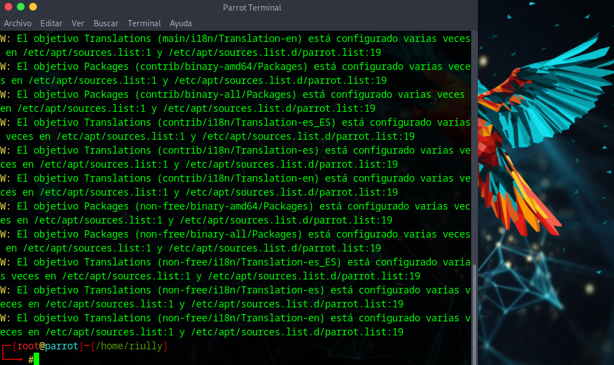
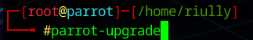
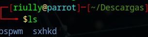
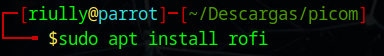

# APUNTES NTRODUCCIÓN A LINUX

## ¿Qué es un sistema operativo?

Un sistema operativo (SO) es un programa que controla todo el hardware y software de un ordenador. Es como el "jefe" que organiza y gestiona todos los recursos y tareas del sistema.

### Funciones Principales de un Sistema Operativo:

1. **Gestión de Procesos**: 
   - **Proceso**: Es un programa en ejecución.
   - **Gestión**: El SO decide qué procesos deben ejecutarse y por cuánto tiempo, asegurando que cada uno reciba suficiente tiempo de CPU.

2. **Gestión de Memoria**:
   - **Memoria RAM**: Es el espacio de trabajo para los programas.
   - **Gestión**: El SO asigna memoria a los programas en ejecución y libera la memoria cuando ya no es necesaria.

3. **Gestión de Almacenamiento**:
   - **Archivos y Carpetas**: Todo se guarda en archivos organizados en carpetas.
   - **Gestión**: El SO maneja la lectura, escritura y organización de estos archivos en dispositivos como discos duros o SSDs.

4. **Control de Dispositivos**:
   - **Periféricos**: Son dispositivos externos como impresoras, monitores, teclados, etc.
   - **Gestión**: El SO actúa como intermediario, facilitando la comunicación entre el software y el hardware.

5. **Interfaz de Usuario**:
   - **GUI y CLI**: Las interfaces pueden ser gráficas (ventanas, íconos) o de línea de comandos (texto).
   - **Gestión**: El SO proporciona estas interfaces para que los usuarios interactúen con el sistema.

## ¿Qué es el pentesting?
***Pentesting o (Pruebas de Penetración)*** es una práctica para evaluar la seguridad de un sistema informático mediante simulaciones de ataques cibernéticos. Para esta tarea, se utilizan herramientas especializadas, y Parrot y Kali Linux son dos sistemas operativos populares entre los pentesters.

## Los sistemas operativos Parrot y Kali Linux para el pentesting

### Kali Linux:

1. **Preconfigurado**: Viene con cientos de herramientas de seguridad y pentesting preinstaladas, como Nmap, Metasploit, Wireshark, y más.
2. **Actualizaciones Frecuentes**: Ofrece actualizaciones regulares para mantener las herramientas al día con las últimas vulnerabilidades y técnicas.
3. **Documentación y Comunidad**: Tiene una amplia documentación y una gran comunidad de usuarios y desarrolladores, lo que facilita encontrar soporte y tutoriales.
4. **Especialización**: Está diseñado específicamente para pentesting y análisis forense, lo que significa que todas las configuraciones y optimizaciones están orientadas a estas tareas.

### Parrot OS:

1. **Multifuncional**: Además de pentesting, está diseñado para desarrollo de software, privacidad y uso diario.
2. **Ligero y Eficiente**: Consume menos recursos que Kali Linux, lo que puede ser útil en equipos con menos potencia.
3. **Seguridad Adicional**: Incluye características de privacidad y seguridad adicionales, como cifrado y anonimato.
4. **Herramientas Preinstaladas**: También viene con una amplia gama de herramientas para pentesting y seguridad informática.


### Uso de Windows para Pentesting (no recomendado)

Aunque Windows puede usarse para pentesting, presenta varias desventajas en comparación con Kali Linux y Parrot OS:

1. **Menos Herramientas Nativas**: Windows no viene preconfigurado con herramientas de pentesting, por lo que hay que instalarlas manualmente, lo que puede ser tedioso.
2. **Compatibilidad**: Algunas herramientas de pentesting están diseñadas específicamente para Linux y pueden no funcionar bien en Windows o requerir adaptaciones.
3. **Entorno de Trabajo**: La gestión de redes, scripts y automatización en Linux es más fluida gracias a la línea de comandos (bash) y scripts, mientras que en Windows puede ser más complicado.
4. **Recursos y Soporte**: Hay menos documentación y comunidad de pentesters utilizando Windows en comparación con Linux, lo que puede dificultar la resolución de problemas y el aprendizaje.
5. **Virtualización y Subsistema Linux**: Aunque Windows 10 y 11 incluyen el Subsistema de Windows para Linux (WSL), que permite ejecutar un entorno Linux dentro de Windows, no es tan eficiente y completo como utilizar un sistema Linux nativo.


## Pasos para descargar parrot OS

1. Lo primero que haremos será entrar en el siguiente [link](https://parrotsec.org/download/)
 el cual nos redirigrá a la página principal del sistema operativo parrot en el apartado de descargas *(a 09/06/2024 se ve de la siguiente manera)*


En este apartado deberemos elegir el apartado que más nos convenga en función de lo que queramos, aquí una breve explicación

- **Live**:
   - Es la versión completa del sistema operativo que se puede ejecutar desde un dispositivo de almacenamiento extraíble sin necesidad de instalación. Esta edición permite instalar Parrot en el ordenador.

- **Virtual**:
   - Optimizada para ejecutarse en máquinas virtuales, perfecta para entornos virtualizados. Compatible con VirtualBox, VMware y UTM.

- **IoT**:
   - Diseñada para dispositivos integrados y plataformas de IoT como Raspberry Pi. 

- **Docker**:
   - Imagen de Docker preempaquetada del sistema operativo Parrot. Disponible en ediciones Core, Home y Security.

- **Debian Conversion Script**:
   - Script rápido para convertir una instalación existente de Debian a Parrot (todas las ediciones).

- **WSL**:
   - Permite usar todo el poder del sistema operativo Parrot en Windows mediante el Subsistema de Windows para Linux.

**En nuestro caso vamos a elegir la opción LIVE.**
(Lo vamos a instalar en un máquina virtual pero si nos bajamos la opción virtual vendrá ya la máquina preconfigurada cosa que no queremos)

2. Ahora tendremos que elegir la edición correspondiente, en nuestro caso elegiremos la **SECURITY**, la opción *home* está pensada de cara a un uso más domestico.


3. Por último deberemos de elegir el tipo de arquitectura **AMD64**.


Una vez finalizados todos los pasos anteriores aparece lo siguiente: 


Basicamente es una breve descripción de la versión que vamos a descargar, nos da diferentes opciones para ejecutar la descarga y **nos dice las credenciales de serie para nuestro sistema**

```
user: parrot
password: parrot
```


## Descarga de VirtualBox

Para ejecutar una máquina virtual existen diferentes aplicaciones, en mi caso he decidido hacer usar **VirtualBox** porque es de código abierto y permite ejecutar varias máquinas a la vez, si que es verdad que existen otras opciones como **Vmware**, pero las versiones gratis son algo más limitadas ya que solo permiten ejecutar una máquina a la vez.

1. Para ejecutar la descargar de VirtualBox nos dirigiremos al siguiente [link](https://www.virtualbox.org/wiki/Downloads) ***a 10/06/24 se ve de la siguiente manera:***


2. Si ahora nos dirigimos al apartado de descargas, nos encontraremos con que deberemos de tener estos 2 archivos  *(el instalador de virutalbox y la máquina parrot)*.


3. Le daremos doble click al ejecutable de virtualbox y nos aparecerá una ventana emergente como la siguiente en la que deberemos darle a **NEXT** en todos los pasos y por último le daremos a **FINISH**:


4. Si se ha instalado correctamente nos debería de aparecer la siguiente ventana emergente


**EN CASO DE QUERER CONFIGURAR LA RUTA DE INSTALACIÓN O EN CASO DE DUDA, CONSULTAR UN TUTORIAL EN YOUTUBE QUE HAY MUCHOS SOBRE INSTALACIÓN DE VIRTUAL BOX**

**EN CASO DE QUE NO FUNCIONE LA MÁQUINA LO MÁS SEGURO ES QUE NECESITEIS ACTIVAR LA VIRTUALIZACIÓN EN LA BIOS, CONSULTAR COMO HACERLO YA QUE DEPENDE DE CADA FABRICANTE, A ALGUNOS YA VIENE ACTIVADA DE SERIE**

## INSTALACIÓN DE LA MÁQUINA PARROT EN VIRTUALBOX

Lo que tendremos que hacer es *CREAR UNA MÁQUINA NUEVA*, desde la propia aplicación web de Parrot ***se te ve baja una ISO*** por lo que tendremos que hacer en VirtualBox es añadir crear una máquina nueva.

1. En el apartado de descargas, Deberemos de tener la ISO **Parrot-security-6.1_amd64**.


2. Ahora dentro de virtualBox, en el apartado superior nos deberíamos encontrar un menú, en el cual le deberemos dar a **NUEVA** (*es una especie de estrella azul*).


3. Ahora nos debería de aparecer una ventana emergente en la que nos solicitará un nombre para la máquina, la carpeta en que se instalará la máquina y la ubicación de la imagen ISO que hemos descargado anteriormente (el resto de campos se autocompletaran al poner la ISO). Por último le daremos a **SIGUIENTE**.


4. La ventana emergente cambiará y ahora tendremos que ajustar la memoria RAM que utilizará la máquina y el número de procesadores que usará. En mi caso pondré **8192MB Y 3CPUs**. Cabe recalcar que no hace falta tanta potencia pero en mi caso tengo un equipo relativamente potente y no hay problema.


5. La ventana emergente cambiará y ahora deberemos indicar el tamaño del disco duro virtual, que será donde se almacenen los datos de la máquina, pondremos **60 GB** y le daremos a **SIGUIENTE**.


6. Por último nos aparecerá un breve resumen de la configuración que hemos realizado en la máquina virtual, si vemos todo correcto, le daremos al botón de **TERMINAR.**


## Arranque de la máquina PARROT

1. Una vez que hemos realizado todos los pasos anteriores con éxito le daremos a **INICIAR** que es el botón que se encuentra en la parte superior derecha que tiene el icono de una flecha apuntando hacia la derecha *(si aparece la foto de linux en blanco y negro es normal)*.


2. Al darle a iniciar, nos encontraremos con la siguiente ventana, en la que deberemos darle a **TRY INSTALL**


3. Después se instalará el sistema operativo, y apareceremos en el escritorio.


4. Si nos fijamos vienen 5 accesos directos en el escritorio, hay uno que se llama **INSTALL PARROT**


5. Hacemos doble click y se nos abrirá la siguiente ventana emergente en la que deberemos configurar el sistema operativo. Lo primero hace referencia al idioma, pondremos **ESPAÑOL DE ESPAÑA** y le daremos a **SIGUIENTE**.


6. El siguiente apartado hace referencia a la ubicación, le daremos **EUROPE**,a **MADRID** y le daremos a **SIGUIENTE**.


7. El siguiente apartado hace referencia a la distribución del teclado, le daremos a **SPANISH** y **DEFAULT**, podemos probar que se ha aplicado correctamente y le daremos a siguiente


8. Ahora hace referencia al apartado de las particiones, en Linux hay un riesgo potencial (durante el arranque se puede cargar una instrucción pulsando la e para aprovechar que estás como root y así cambiar la contraseña) Por ello es recomendable en este apartado darle a **BORRAR EL DISCO**, darle tick a **CIFRAR SISTEMA** y poner una **CONTRASEÑA** para evitar esta vulnerabilidad, por último le daremos a **SIGUIENTE**.


9. Ahora nos pide que indiquemos un nombre, que nombre queremos para iniciar sesión que nombre le ponemos para el equipo y una contraseña *(RECOMENDABLE NO DARLE A INICIAR SESIÓN AUTOMATICAMENTE)*.


10. Nos aparece un apartado a modo de resumen de todo lo que hemos configurado y tendremos que dar a **INSTALAR**


11. Al darle, debería aparecer otra ventana emergente en la que deberemos darle a **INSTALAR AHORA**.


12. Debería comenzar la instalación.


13. Al terminar se debería de ver tal que así y le daremos a **HECHO** y la máquina se reiniciará como tal, puede ser que nos aparezca al reiniciarse otra vez lo que nos aparecia al principio de *TRY / INSTALL* cosa que deberemos evitar, si nos aparece esto cerraremos la máquina directamente, es decir, la apagamos.


14. Ahora debemos entrar en la **CONFIGURACIÓN** de la máquina en VirtualBox que se encuentra en el menú de la parte superior.


15. Ahora iremos al apartado de **ALMACENAMIENTO** y dentro de este, debajo del **CONTROLADOR: IDE**, nos encontraremos con el nombre de la ISO, esto por decirlo de algún modo es como si metieramos un usb de arranque en nuestra máquina física para instalar un sistema operativo, pues una vez instalado, hay que quitarlo para que no salte el instalador, por ello le daremos click derecho encima del nombre de **Parrot-security-6.1_amd64.iso** y la daremos a **ELIMINAR** CONEXIÓN**


16. Ahora deberemos arrancar la máquina y lo primero que nos pedirá es la contraseña de cifrado del sistema operativo que hemos introducido anteriormente.


17. Una vez introducida se queda un rato desencriptando todo y luego nos aparecerá la siguiente ventana en la que le daremos a la primera opción **Parrot OS 6 GNU/Linux**


18. Ahora nos debería de aparecer la ventana de inicio de sesión en la que nos pedirá la contraseña del usuario.


19. Y por último tras seguir todos los pasos anteriores nos deberiamos de encontrar finalmente con el escritorio.


## Personalización del entorno de PARROT

1. Borramos la carpeta **README.license** del escritorio


2. Abrimos una terminal (parte superior le damos a este icono).


3. En la terminal nos moveremos usando el comando cd al escritorio (desktop) y luego crearemos una carpeta que la llamaremos con el mismo nombre que tiene nuestro usuario, en mi caso **Riully**
```
cd Desktop/
```
- después haremos lo siguiente:
```
mkdir Riully
```


- Si hemos realizado lo anterior correctamentes nos debería de crear una carpeta en el escritorio con el nombre de nuestra cuenta tal que así:


### Actualización del sistema

1. Antes de entrar en el apartado de la personalización vamos a actualizar el sistema. Volvemos a a abrir la terminal como hicimos anteriormente:


- Abrimos la consola y escribiremos **sudo su**, le daremos a intro y luego nos pedirá la contraseña que tenemos para nuestro usuario, esto se hace para invocar los permisos de administrador:

```
sudo su
```


- Una vez estemos como root, intentaremos hacer un **apt update**, lo más probable es que nos de error al hacerlo.



- Para poder arreglar lo que casca nos deberemos dirigir a la ruta que hemos indicado en la captura que se encuentra debajo haciendo un nano a la ruta en cuestión

```
nano /etc/apt/sources.list
```


- Una vez hecho lo anterior nos aparecerá una primera linea como la siguiente:


- Lo que debemos hacer es comentar la primera del cuadro del texto poniendo un **"#"** al principio, debería quedar de la siguiente manera.


- Para guardar los cambios haremos **CTRL S** y para cerrar el texto **CTRL X** y volveremos a hacer un **APT UPDATE**


- Si sale de la siguiente manera es porque hemos realizado con exito la actualización.


- En parrot no deberemos usar más el **APT UPGRADE** porque es probable que se cargue el sistema, Parrot tiene su propia forma de actualizarse que se llama **parrot-upgrade** así que vamos a ponerlo.
```
parrot-upgrade
```


- Si todo ha ido correctamente nos aparecerá de la siguiente manera:


- Podemos observar que en mi caso hay 3 paquetes que se instalaron de forma automática y que ya no son necesarios que son los siguientes:


- Por lo tanto vamos a desinstalarlos usando el siguiente comando
```
apt-remove (nombre)
```
- En este caso como serian 3 paquetes podriamos hacer lo siguiente
```
apt remove python3-markdown samba-ad-provision samba-dsdb-modules
```


- Nos preguntará si los queremos eliminar, escribiremos una **S** y le daremos a **INTRO**


- Ahora haremos un **APT UPDATE** y veremos que se ha actualizado todo correctamente


## Instalación y configuración de Bspwm y Sxhkd

**BSPWM** es el entorno de trabajo en el que vamos a estar operando, nos vamos a mover a descargas
```
cd /home/riully/Descargas/
```


- Una vez aquí instalaremos todos los paquetes que vamos a usar para la configuración de atajos y para la personalización. Dejaré aquí para que se copien todos los archivos de los que estariamos hablando

```
apt install build-essential git vim xcb libxcb-util0-dev libxcb-ewmh-dev libxcb-randr0-dev libxcb-icccm4-dev libxcb-keysyms1-dev libxcb-xinerama0-dev libasound2-dev libxcb-xtest0-dev libxcb-shape0-dev
```


- Ahora al igual que antes escribiremos una **S** y le daremos a **INTRO**


- Una vez instalado haremos un **APT UPDATE**


- Nos saldremos del modo root escribiendo **EXIT**


- Ahora vamos a clonar los repositorios de **bswpm** y **sxhkd** de la siguiente manera:
```
git clone https://github.com/baskerville/bspwm.git
```
```
git clone https://github.com/baskerville/sxhkd.git
```


- Ahora vamos a instalarlos, por lo que lo que tendremos que hacer será lo siguiente:
```
cd bspwm
```
```
ls
```
```
make
```


- Lo sigueinte será hacer un
```
sudo make install
```


- Nos pedirá la contraseña y se instalará posteriormente


- Si ponemos el siguiente comando comprobaremos que se ha instalado


- Ahora podremos los siguiente comandos para salirnos de esta ruta e ir a la correspondiente para bajarnos el otro

```
cd ..
```
```
cd sxhkd/
```


- Ahora escribiremos el comando make para proceder con al instalación
```
make
```


- Y ahora sudo make install

```
sudo make install
```


- Ahora hacemos un which para comprobar que se ha instalado

```
which sxhkd
```

El archivo de configuración de **bspwm** -> **bspwmrc** y de **sxhkd** es **sxhkdrc**, de primeras estos archivos no existen por lo que vamos a crear usando **mkdir** en ```.config ``` que es un archivo oculto del sistema, accederemos a el metiendo el metiendo lo siguiente:
```
cd ..
```

```
mkdir ~/.config/{bspwm,sxhkd} 
```


- Dentro de bspwm , hay un directorio examples que debería detener 2 archivos **bspwmrc** y **sxhkdrc**
```
cd bspwm/examples/
```
```
ls
```


- Vamos a comenzar con los pasos más importantes:
```
cp bspwmrc ~/.config/bspwm/
```
```
cp sxhkdrc ~/.config/sxhkd/
```


- Ahora vamos a ir configurando  el archivo **sxhkdrc** primero entraremos en la ubicación de **sxhkd** haremos un ls para comprobar que está el archivo y luego haremos un nano para modificarlo.

```
cd ~/.config/sxhkd/
```
```
ls
```
```
nano sxhkdrc
```


- El aspecto que tiene el archibo de configuración es el siguiente:


- En el archivo las teclas mencionadas como **super** hacen referencia a la **tecla de windows** y **return** es el **enter** y al pulsarlas abriria un urxvt pero esto no existe porque es un gnome-terminal, vamos a emplear una kitty que por defecto no existe por lo que vamos a descargarla, nos salimos del archivo de texto usando **CTRL + X**, nos podemos en sudo y la instalamos, en total deberemos ejecutar los siguientes comandos:

``` 
sudo su
```
```
apt install kitty
```
- Y le damos a la **S** para confirmar la instalación


- Cabe recalcar que la instalación de kitty que acabamos de hacer al hacerla de esta manera no es la última disponible pero más adelante lo upgradearemos, vamos a comprobar la versión de la siguiente manera
```
kitty --version
```


- Si hacemos un which veremos donde se encuentra instalado (la ruta)


- Ahora haremos un nano al archivo de configuracion **sxhkdrc**
```
nano sxhkdrc
```


- Y lo que haremos será modificar alguno de los atajos que tiene, vamos a modificar el terminal emulator para que pulsar **super + return** que recordamos que **super** era la **tecla de windows** y **return** era la tecla **enter**
```
/usr/bin/kitty
```


- Es lo único que tendríais que configurar del archivo por lo que ahora haremos **CTRL + S** que sería para guardar. Debería verse el archivo tal que así:


- Un poco más abajo nos encontraremos un apartado que se llama **quit/restart bspwm** que nos encontraremos como default **super + alt + {q,r}**, esto significa lo siguiente. Nosotros vamos en meter en **bspwmrc** todas las instrucciones que queremos que se ejecuten cuando nos cargue el entorno *(configuración del fondo de pantalla, hablitación clipboard bidireccional)*. Cuando tu retocas con estas instrucciones el **bspwmrc** necesitas que se actualice y se apliquen los cambios tienes que reiniciar el servicio de **bspwm** y eso se hace con la instruccion que hemos visto anteriormente **super + alt + r**. 

- Cuando usemos **super + alt + q** sería como quitar el **bspwm** y volver a la pantalla de bloqueo (sin cerrarlo)

- cuando nosotros usemos **super + alt + {q,r}** y lo vamos a cambiar por **super + shift + {q,r}**
```
super + shift + {q,r}
```


- En el apartado que se encuentra más abajo nos encontraremos el **close and kill** que es un apartado exclusivo para cerrar la ventana de **bspwm** que tengamos abierta.

- En este apartado la configuración por default veremos que pone lo siguiente: 


- Nosotros lo vamos a cambiar por *super + {_,shift + }q*
```
super + {_,shift + }q
```


- Ahora explicaremos un apartado que se llama fouces the node in the given direction, que lo que haces es que muestra un reborde blanco en la ventana que estas trabajando, basicamente esto te es util cuando tienes multiples ventanas abiertas.


- Vamos a cambiarlo porque actualmente se hace con las letras h,j,kl y vamos a hacer que esto se haga por las fechas de dirección por lo que cambiaremos esa linea por la siguiente:
``` 
super + {_,shift + }{Left,Down,Up,Right}
```


- Otro apartado que vamos a tener que tocar es **preselected the direction**, en este, vamos a elegir el tamaño de las ventanas que vamos a abrir, y lo tendremos que cambiar las letras por las flechas como antes, la linea cambiada quedaria de la siguiente manera:
```
super + ctrl + {Left,Down,Up,Right}
```


- En el apartado de **cancel the preselection for the focused node** sirve para quitar una preseleccion de ventana, vamos a modificarlo para dejarlo de la siguiente manera.
```
super + ctrl + alt + space
```


- En la última parte del codigo vamos a encontrarnos lo siguiente, que lo deberemos de **eliminar**


- Esto es debido a que esto más adelante lo vamos a controlar gracias a 2 archivos que vamos a crear personalizados.

- El último apartado que se llama **move a floating window** hace referencia a mover ventanas flotantes, vamos a modificiarlo para que quede la siguiente manera:
```
super + alt + {Left,Down,Up,Right}
```


- Ahora vamos a crear uno nuevo que se llama **custom resize** para que cuando haga windows alt izquierda la ventana se vaya desplazando hacia la izquierda para ajustar su tamaño básimacamente.

- En la imagen que tenemos debajo de este parrafo vemos lo que seria el primer apartado de la configuracion, ponemos el nombre con un # delante para que lo ignore, es decir, es como un comentario y luego ponemos las teclas con las que se activaria.


- El mapeo de como lo tendria que hacer lo haremos posteriormente en un apartado que se llama **bspwm_resize**, pongo el texto completo con la ruta en la que estaria
```
# Custom Resize
super + alt + {Left,Up,Down,Right}
/home/riully/.config/bspwm/scripts/bspwm_resize {west,south,north,west}
```


AHORA FINALMENTE HAREMOS ```CTRL + S``` Y ```CTRL + X``` (guardar y cerrar) y se nos saldrá del archivo.

- Nos salimos como usuario root usando **EXIT**
```
exit
```
- Y acto seguido escribimos la siguiente ruta:
```
cd /home/riully/.config/bspwm/
```


- Ahora hacemos un **mkdir**
```
mkdir scripts
```
```
cd scripts
```


- Ahora con un touch creamos...
```
touch bspwm_resize
```

- Y ahora un:
```
chmod +x bspwm_resize
```

- Y por último_
```
nano bspwm_resize
```


- y dentro del archivo deberemos de meter el siguiente contenido:
```
#!/usr/bin/env dash

if bspc query -N -n focused.floating > /dev/null; then
	step=20
else
	step=100
fi

case "$1" in
	west) dir=right; falldir=left; x="-$step"; y=0;;
	east) dir=right; falldir=left; x="$step"; y=0;;
	north) dir=top; falldir=bottom; x=0; y="-$step";;
	south) dir=top; falldir=bottom; x=0; y="$step";;
esac

bspc node -z "$dir" "$x" "$y" || bspc node -z "$falldir" "$x" "$y"
```
AHORA FINALMENTE HAREMOS ```CTRL + S``` Y ```CTRL + X``` (guardar y cerrar) y se nos saldrá del archivo.

## Instalación Polybar, Picom y Rofi

- Entramos como administradores con el comando ```sudo su```
```
sudo su
```


- Ahora vamos a instalar la polybar
```
apt install polybar
```


- Hay que escribir una S para confirmar que queremos continuar


- y ya estaría 


- Ahora vamos a instalar picom, deberemos entrar en el siguiente [enlace](https://github.com/yshui/picom)
 y copiar el texto que ponga el siguiente apartado


```
libconfig-dev libdbus-1-dev libegl-dev libev-dev libgl-dev libepoxy-dev libpcre2-dev libpixman-1-dev libx11-xcb-dev libxcb1-dev libxcb-composite0-dev libxcb-damage0-dev libxcb-glx0-dev libxcb-image0-dev libxcb-present-dev libxcb-randr0-dev libxcb-render0-dev libxcb-render-util0-dev libxcb-shape0-dev libxcb-util-dev libxcb-xfixes0-dev meson ninja-build uthash-dev
```

- Debereis instalar todo esto en parrot, como haremos esto? pues simplemente pegaremos todo el codigo y antes de ello pondremos apt install, es decir, de la siguiente manera (también le metemos al final un -y para saltarnos la confirmación de instalación):

```
apt install libconfig-dev libdbus-1-dev libegl-dev libev-dev libgl-dev libepoxy-dev libpcre2-dev libpixman-1-dev libx11-xcb-dev libxcb1-dev libxcb-composite0-dev libxcb-damage0-dev libxcb-glx0-dev libxcb-image0-dev libxcb-present-dev libxcb-randr0-dev libxcb-render0-dev libxcb-render-util0-dev libxcb-shape0-dev libxcb-util-dev libxcb-xfixes0-dev meson ninja-build uthash-dev -y
```


- Ahora tenemos que hacer un ```apt update```
```
apt update
```


- Ahora nos salimos del usuario privilegiado con un ```exit```
```
exit
```


- Escribimos un ```whoami``` para comprobar que estamos en nuestro usuario
```
whoami
```


- Nos movemos a descargas con el siguiente comando:
```
cd Descargas/
```


- Comprobamos con el comando ```ls``` el contenido que tenemos dentro
``` 
ls
```


- ahora haremos un ```git clone``` al directorio de [picom](https://github.com/yshui/picom)

```
git clone https://github.com/yshui/picom
```


- Ahora nos metemos dentro de picom con un ```cd```
```
cd picom/
```


- En el propio readme de [picom](https://github.com/yshui/picom) nos encontraremos un apartado que se llama **TO BUILD** el cual nos dice las instrucciones para instalarlo, lo primero que nos encontraremos son estos 2 comandos.


```
meson setup --buildtype=release build
ninja -C build
```

- Por lo que dentro del directorio de picom pondrás el primer comando, es decir:

```
meson setup --buildtype=release build
```


- Ahora ponemos el segundo comando

```
ninja -C build
```

### IMPORTANTE

Me ha dado error al instalar ````meson setop --buildtype=realease build````


esto error lo que impide es que puedas insertar el comando de ```ninja -C build```


### ¿Como lo arreglé?
EJECUTAR LOS SIGUIENTES COMANDOS:
```
sudo apt update
```
```
sudo apt install cmake
```
```
meson setup --buildtype=release build
```
```
ninja -C build
```
### Continuación

- Si ahora seguimos veremos que no está instalado a nivel de sistema picom, es decir, si hacemos un which picom no saldrá ninguna ruta.

- Para terminar de instalarlo hay que hacer un 
```
ninja -C build install
```
- Es normal que te salte una alerta y te pida una contraseña (es la de iniciar sesion)


- Si ahora hacemos un ```which picom``` si aparecerá la ruta

`


- Ahora vamos a instalar rofi
```
sudo apt install rofi
```



4:25